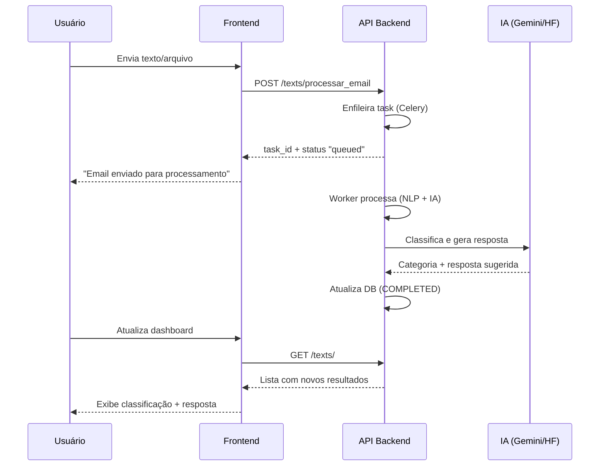

````markdown
# AutoU Email Classifier - Frontend

> Interface web moderna para classificação automática de emails usando Inteligência Artificial

Este projeto é o **frontend** da solução AutoU, desenvolvida como parte de um teste técnico para automatizar a classificação de emails em uma grande empresa do setor financeiro. A aplicação oferece uma interface intuitiva para que usuários possam enviar emails (texto ou arquivos PDF/TXT) e receber classificações automáticas junto com sugestões de resposta geradas por IA.

## 🎯 Sobre o Projeto

### Contexto e Objetivo

Grandes empresas lidam diariamente com um alto volume de emails que podem ser solicitações de status, uploads de arquivos, ou comunicações improdutivas. Este frontend conecta-se à API AutoU para:

- **Classificar emails automaticamente** em categorias predefinidas
- **Gerar sugestões de resposta** baseadas na classificação por IA
- **Organizar e visualizar** o histórico de processamentos
- **Proporcionar uma experiência** moderna e responsiva

### Categorias de Classificação

- **📈 Produtivo**: Emails que exigem ação ou resposta específica
- **📭 Improdutivo**: Emails que não exigem ação imediata

## 🚀 Stack Tecnológica

| Tecnologia           | Versão | Propósito                                         |
| -------------------- | ------ | ------------------------------------------------- |
| **React**            | 18+    | Biblioteca para construção de interfaces reativas |
| **Vite**             | 5+     | Build tool moderna com Hot Module Replacement     |
| **Tailwind CSS**     | 3+     | Framework CSS utilitário para estilização rápida  |
| **React Router DOM** | 6+     | Roteamento do lado do cliente (SPA)               |
| **Axios**            | 1+     | Cliente HTTP robusto para comunicação com API     |
| **React Hot Toast**  | 2+     | Sistema de notificações elegantes                 |
| **Lucide React**     | Latest | Biblioteca de ícones SVG modernos                 |

## ✨ Funcionalidades

### 🔐 Sistema de Autenticação

- [x] **Registro de usuários** com validação de email e senha
- [x] **Login seguro** com autenticação JWT
- [x] **Rotas protegidas** com redirecionamento automático
- [x] **Logout automático** em caso de token expirado
- [x] **Persistência de sessão** via localStorage

### 📧 Processamento de Emails

- [x] **Envio de texto** direto para classificação
- [x] **Upload de arquivos** PDF e TXT (até 10MB)
- [x] **Validação robusta** de tipos e tamanhos de arquivo
- [x] **Feedback visual** durante processamento
- [x] **Tratamento de erros** com retry automático

### 📊 Histórico e Resultados

- [x] **Dashboard completo** com listagem de emails processados
- [x] **Estados visuais** (Processando/Concluído/Falhou)
- [x] **Classificações** com badges coloridos
- [x] **Respostas sugeridas** pela IA expansíveis
- [x] **Ordenação automática** por data de criação

### 🎨 Interface e Experiência

- [x] **Design moderno** com tema escuro
- [x] **Totalmente responsivo** para desktop e mobile
- [x] **Componentes reutilizáveis** bem estruturados
- [x] **Estados de loading** e animações suaves
- [x] **Sistema de notificações** não-intrusivo
- [x] **Validação de formulários** em tempo real

## 🏗️ Arquitetura do Frontend

```
src/
├── components/          # Componentes reutilizáveis
│   ├── Layout.jsx      # Layout principal com navegação
│   ├── Loading.jsx     # Indicador de carregamento
│   ├── ProtectedRoute.jsx # Wrapper para rotas protegidas
│   └── EmailResultCard.jsx # Card expandível de resultados
├── pages/              # Páginas da aplicação
│   ├── Login.jsx       # Tela de login
│   ├── Register.jsx    # Tela de cadastro
│   └── Dashboard.jsx   # Dashboard principal
├── services/           # Camada de comunicação com API
│   ├── api.jsx         # Configuração do Axios
│   └── index.jsx       # Serviços organizados por domínio
├── hooks/              # Hooks customizados
│   └── useAuth.jsx     # Context de autenticação
├── utils/              # Utilitários e formatters
└── context/            # Contexts do React
```

## 🛠️ Instalação e Execução

### Pré-requisitos

- **Node.js** 18+ instalado
- **npm** ou **yarn** como gerenciador de pacotes
- **API Backend** rodando em `http://127.0.0.1:8000`

### 📥 Clonagem e Setup

```bash
# Clone o repositório
git clone git@github.com:ViniciusLugli/AutoU-Email-Front.git
cd AutoU-Email-Front

# Instale as dependências
npm install

# Configure as variáveis de ambiente (opcional)
cp .env.example .env
```

### ⚙️ Configuração de Ambiente

Crie um arquivo `.env` baseado no `.env.example`:

```bash
# URL da API (ajuste conforme necessário)
VITE_API_BASE_URL=http://127.0.0.1:8000

# Configurações opcionais
VITE_APP_TITLE="AutoU Email Classifier"
VITE_APP_VERSION=1.0.0
```

### 🚀 Executar em Desenvolvimento

```bash
npm run dev
```

Acesse: **http://localhost:5173**

### 🏗️ Build para Produção

```bash
npm run build
npm run preview  # Para visualizar o build local
```

## 📡 Integração com API Backend

### Endpoints Consumidos

| Método | Endpoint                 | Propósito                              | Autenticação |
| ------ | ------------------------ | -------------------------------------- | ------------ |
| `POST` | `/auth/register`         | Registro de novos usuários             | ❌           |
| `POST` | `/auth/login`            | Autenticação e obtenção de JWT         | ❌           |
| `GET`  | `/auth/me`               | Obter perfil do usuário atual          | ✅           |
| `POST` | `/texts/processar_email` | Enviar email para classificação        | ✅           |
| `GET`  | `/texts/`                | Listar histórico de emails processados | ✅           |
| `GET`  | `/texts/{id}`            | Obter detalhes de um email específico  | ✅           |
| `GET`  | `/health`                | Verificar saúde da API                 | ❌           |

### 🔄 Fluxo de Processamento



## 🎨 Design System

### Paleta de Cores

Inspirada na identidade visual da AutoU, utilizando:

- **Fundo Principal**: `#1a1a1a` (cinza escuro)
- **Cor de Destaque**: `#a855f7` (roxo vibrante)
- **Texto Primário**: `#ffffff` (branco)
- **Texto Secundário**: `#9ca3af` (cinza claro)
- **Estados de Sucesso**: `#10b981` (verde)
- **Estados de Erro**: `#ef4444` (vermelho)

### Componentes Visuais

- **Cards com bordas arredondadas** e sombras sutis
- **Animações suaves** para transições
- **Estados visuais claros** para diferentes status
- **Responsividade** com breakpoints bem definidos

## 🔧 Scripts Disponíveis

```bash
npm run dev          # Servidor de desenvolvimento
npm run build        # Build para produção
npm run preview      # Preview do build local
npm run lint         # Verificação de código (ESLint)
```

## 📝 Estrutura de Commits

Este projeto segue a convenção de commits semânticos:

- `feat:` Nova funcionalidade
- `fix:` Correção de bugs
- `docs:` Documentação
- `style:` Formatação de código
- `refactor:` Refatoração
- `chore:` Tarefas de build/configuração

## 🤝 Contribuição

1. Faça um fork do projeto
2. Crie uma branch para sua feature (`git checkout -b feature/nova-funcionalidade`)
3. Commit suas mudanças (`git commit -m 'feat: adiciona nova funcionalidade'`)
4. Push para a branch (`git push origin feature/nova-funcionalidade`)
5. Abra um Pull Request

## 📄 Licença

Este projeto foi desenvolvido como parte de um teste técnico para a AutoU.

---

**Desenvolvido com ❤️ usando React + Vite + Tailwind CSS**
````
